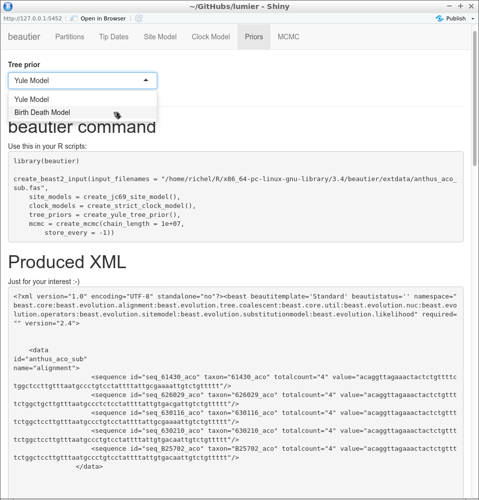

# lumier

[](https://github.com/ropensci/onboarding/issues/209)

Branch|[](https://travis-ci.org)|[](https://www.codecov.io)
---|---|---
master|[](https://travis-ci.org/richelbilderbeek/lumier)|[](https://codecov.io/github/richelbilderbeek/lumier/branch/master)
develop|[](https://travis-ci.org/richelbilderbeek/lumier)|[](https://codecov.io/github/richelbilderbeek/lumier/branch/develop)

`lumier` is an R package that shows the usage of `beautier` by a Shiny app.



## Installation

```
devtools::install_github("richelbilderbeek/lumier")
```

## Usage

```
library(lumier)
lum_run()
```

[](https://ropensci.org)
